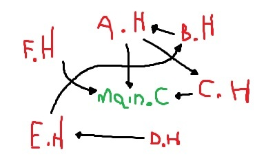

jsmoke design
=============

Jsmoke design related stuff.

> [!IMPORTANT]
>
> 1. all images here was made using [draw.io], [Camunda] and/or
> [Microsoft Paint] free features
> 2. a lot of concepts are explained here. I've placed some content
>    sources at this page's footnotes[^1]. Unfortunately, is not
>    sorted alphabetically but you can take a look

[draw.io]: https://www.drawio.com/
[Camunda]: https://camunda.com/
[Microsoft Paint]: https://www.microsoft.com/en-ca/windows/paint

## 1. The basics

The jsmoke app is a [cargo] inspired CLI. So, it looks like this:

[cargo]: https://github.com/rust-lang/cargo

_Figure 1.1: basic project procedure schema_

where:
- `input` means the cli input
- `logical stuff` is self-explanatory
- `output` means both `std(out|err)` visual and the program's exit
  code

### 1.1 Basic schema details

Even if `output` means **output message**, the printing trigger
should be handled during the program's runtime instead of calling it
in an _"after-run"_ way.

With that in mind, our program stops being
[[_figure 1.1_](#figure-01-01)] and starts being the following figure:

_Figure 1.2: a better detailed program procedures_

Since **Rust** is a compiled system's language, the exit code will
always be an integer type value (`i32` to be specific) where:
- `0` means no error
- `N where N != 0` means error

A more elegant way to face the schema:

_Figure 1.3: an elegant app design schema (details about the `Ok|Err`
value can be found at the **Rust's result** footnote[^1])_

### 1.2 Source division

> Why using a divided source code instead of a single one?

When trying to maintain a program by adding features/fixing a bug,
you'll notice that's a lot harder to do the job when all the code
is _"glued together"[^2]_.

_Figure 1.4: example of include hell (from C lang)_

So, we can divide our app into different pieces of features where one
**uses** the other but they aren't dependent.

[^1]: Rust's `Result` is an enum type with two variants (`Ok(_)` and
  `Err(_)`). Read more on the
  [official doc page](https://doc.rust-lang.org/std/result/).
[^2]: Glue code is a term used to describe a code that works like a
  bridge between different components of the application. It's a
  important concept in coding scene but can lead the project to an
  unreadable/irreparable state when done poorly.
