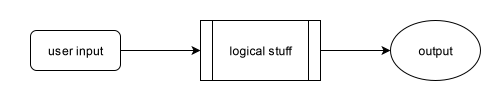

jsmoke design
=============

Jsmoke design related stuff.

> [!IMPORTANT]
>
> All images here was made using [draw.io], [Camunda] and/or
> [Microsoft Paint] free features.

[draw.io]: https://www.drawio.com/
[Camunda]: https://camunda.com/
[Microsoft Paint]: https://www.microsoft.com/en-ca/windows/paint

## 1. The basics

The jsmoke app is a [cargo] inspired CLI. So, it looks like this:

[cargo]: https://github.com/rust-lang/cargo

_Figure 1.1: basic project procedure schema_

where:
- `input` means the cli input
- `logical stuff` is self-explanatory
- `output` means both `std(out|err)` visual and the program's exit
  code

### 1.1 Basic schema details

Even if `output` means **output message**, the printing trigger
should be handled during the program's runtime instead of calling it
in an _"after-run"_ way.

With that in mind, our program stops being
[[_figure 1.1_](#figure-01-01)] and starts being the following figure:

_Figure 1.2: a better detailed program procedures_

Since **Rust** is a compiled system's language, the exit code will
always be an integer type value (`i32` to be specific) where:
- `0` means no error
- `N where N != 0` means error
